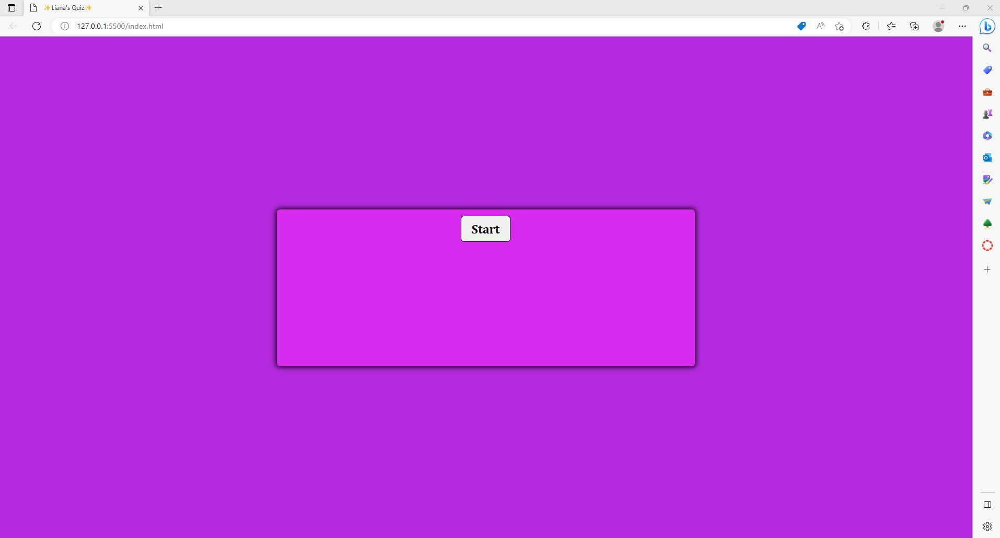

# NO BRAINER JAVA

# DETAILS
This is a timed quiz with 4 Javascript questions.

# WHAT I LEARNED..
I became more familiar/comfortable with creating a css and HTML file. 
I became more comfortable with using Java with things such as.. 
declaring variables, functions, setInterval, arrays and the DOM.

# TECHNOLOGIES USED:
*HTML
 
*CSS
 
*JAVASCRIPT

# HELPFUL WEBSITES I USED
https://www.oracle.com/
 
https://www.w3schools.com/html/
 
https://www.w3schools.com/css/default.asp
 
https://www.w3schools.com/js/default.asp
 
https://jsoup.org/apidocs/org/jsoup/nodes/Element.html

# DEPLOYED WEBPAGE
<a href="https://lianajayde.github.io/No_Brainer_Java/">No Brainer Java</a>
 

 
